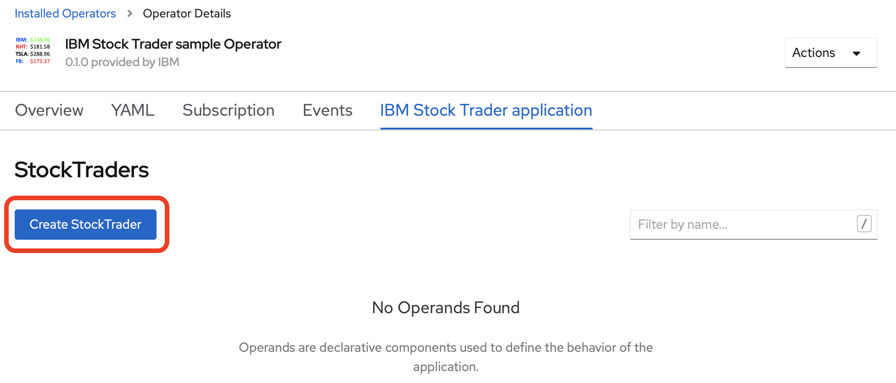
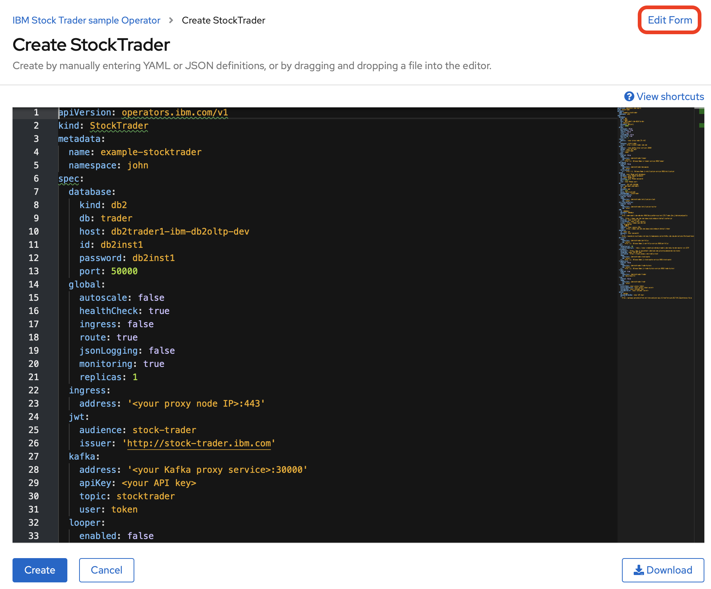
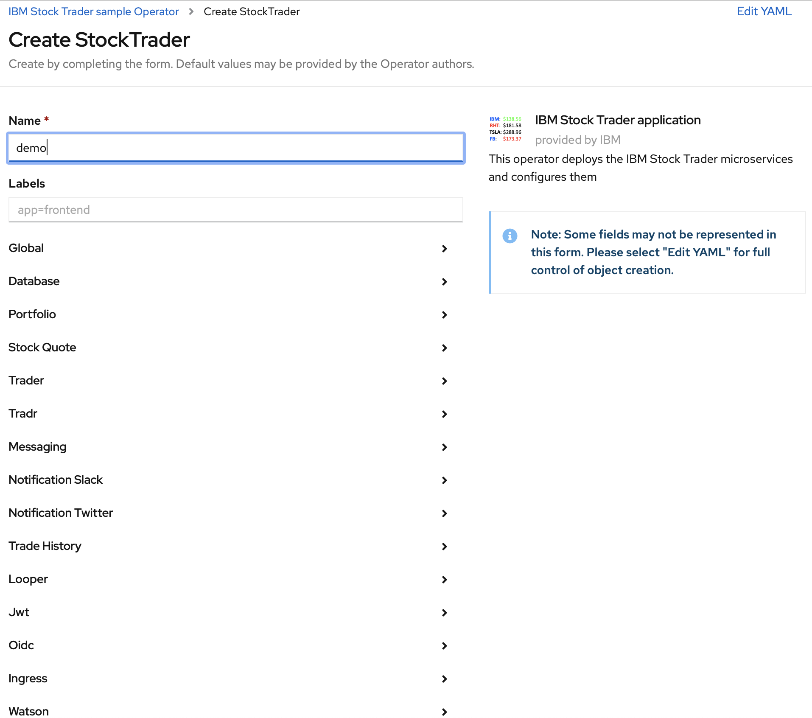
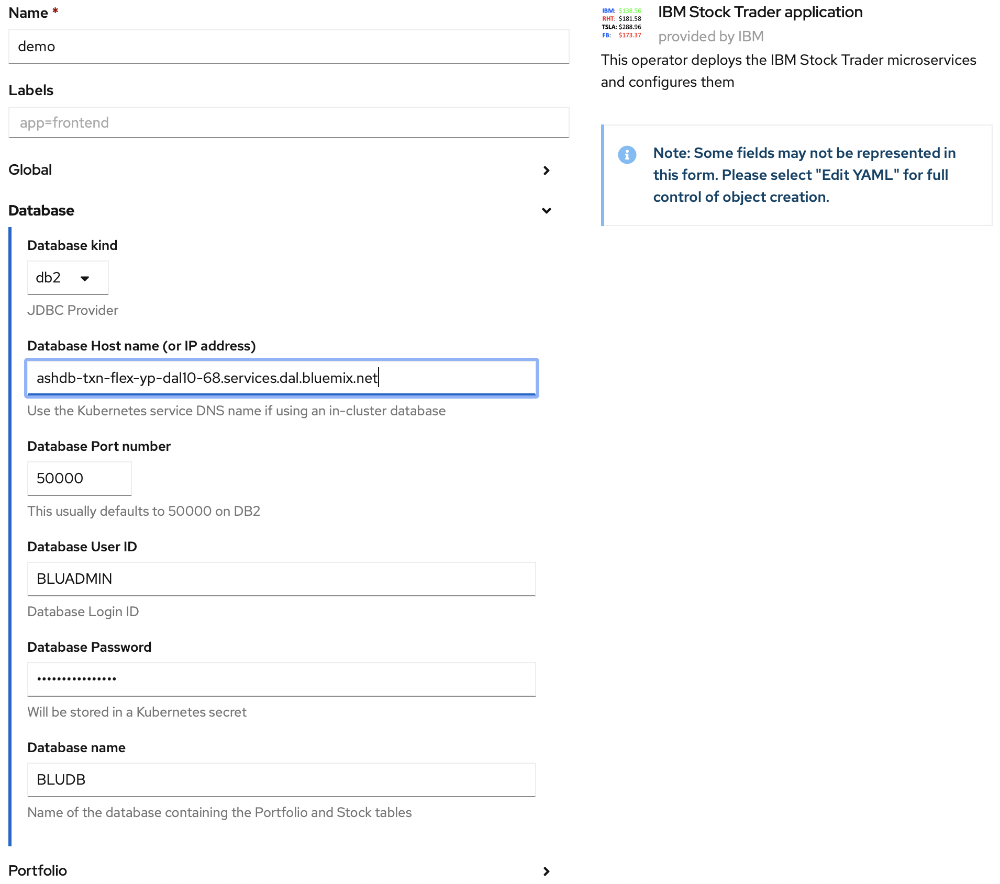
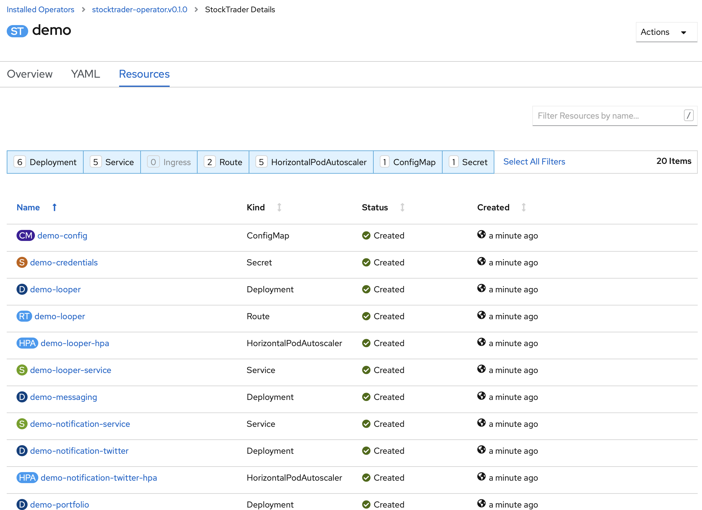
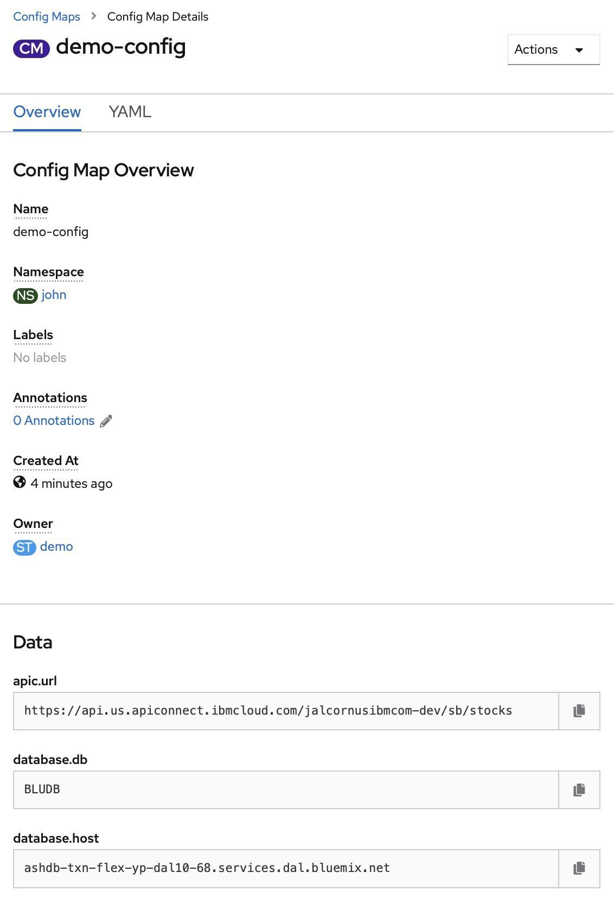
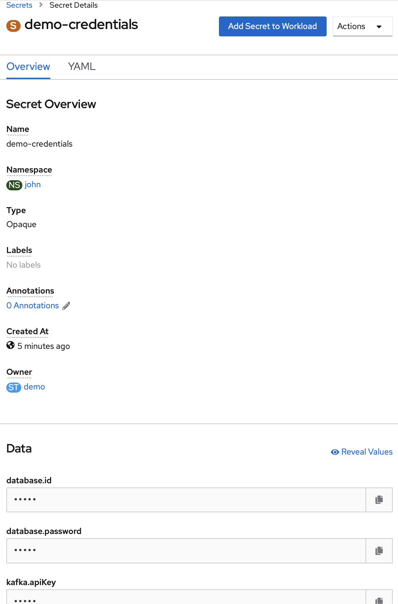
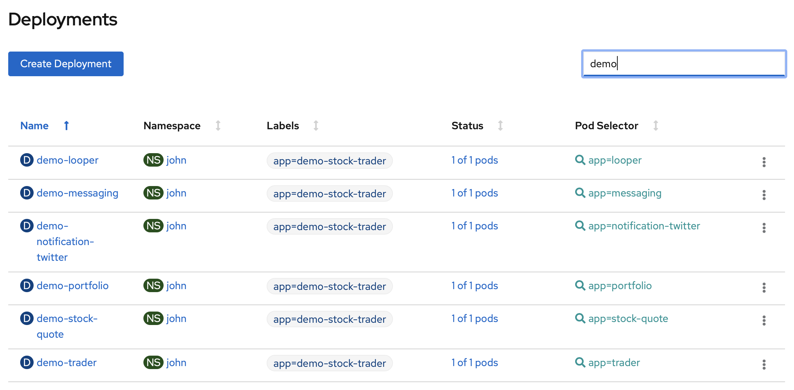

# IBM Stock Trader operator
This operator is intended to install all of the microservices from the IBM Stock Trader sample, and configure them to talk to services they require.

Note it does NOT install such prereqs, like DB2 or MQ - it just asks you to tell it how to connect to such services you already have - whether they be running in the same Kube cluster, or out in a public cloud.

It is a follow-on to the helm chart I created earlier, and described at https://medium.com/cloud-engagement-hub/using-an-umbrella-helm-chart-to-deploy-the-composite-ibm-stock-trader-sample-3b8b69af900d.


This repository contains the results of using the Operator SDK to turn the umbrella helm chart (in the sibling `stocktrader-helm` repo - which must be built first, via `helm package stocktrader` in that repo) into a Kubernetes Operator.
The SDK was installed to my Mac via `brew install operator-sdk`, which gave me v0.15.0.  I ran the following command to create the contents of this repo:
```
operator-sdk new stocktrader-operator --api-version=operators.ibm.com/v1 --kind StockTrader --type helm --helm-chart ../stocktrader-helm/stocktrader-1.2.0.tgz
```
Mostly I followed the instructions here: https://docs.openshift.com/container-platform/4.3/operators/operator_sdk/osdk-helm.html

The operator is built by going to the `stocktrader-operator` subdirectory and running the following command:
```
operator-sdk build stocktrader-operator
```
This produces a `stocktrader-operator:latest` Docker image, which I then pushed to DockerHub via the following usual commands (if building yourself, you'll need to push to somewhere that you have authority, and will need to update the `operator.yaml` to reference that location):
```
docker tag stocktrader-operator:latest ibmstocktrader/stocktrader-operator:latest
docker push ibmstocktrader/stocktrader-operator:latest
```
The results of building this repo are in DockerHub at https://hub.docker.com/r/ibmstocktrader/stocktrader-operator

Deploy the operator, and its CRD (which I hand-edited extensively, mostly in the `openAPIV3Schema` section), via the following, in the specified order (of course, if you want it to go to a namespace other than the one configured by `oc login`/`oc project`, add it via a `-n` parameter to the commands below):
```
oc create -f deploy/crds/operators.ibm.com_stocktraders_crd.yaml
oc create -f deploy/service_account.yaml
oc create -f deploy/role.yaml
oc create -f deploy/role_binding.yaml
oc create -f deploy/operator.yaml
```
You can do a standard `oc get pods` to see that the operator is running, ready to respond to new CustomResources (CRs) being installed of kind `StockTrader`.

If you will want the operator to show up in the Operators catalog page, you must modify the file `deploy/operator_group.yaml` so that the namespace matches the one you wish to use and deploy it too.

```
oc create -f deploy/operator_group.yaml 
```

If you want to deploy via command line, an example CR yaml can be deployed with the following command:
```
oc create -f deploy/crds/operators.ibm.com_v1_stocktrader_cr.yaml
```
You can first edit this file to add any of the fields specified in the values.yaml, such as the `database.host`.
Or, just run the default, then edit the values in the config map and/or the secret, which is where most of the settings from the values.yaml end up.
For example, the `database.host` and `database.port` are placed in the config map (called `{name}-config`) that gets generated for you, and the `database.id` and `database.password` are in the generated secret (called `{name}-credentials`).
The various microservices in the IBM Stock Trader sample look in this config map and secret during pod startup for their configuration values.

You can generate the ClusterServiceVersion (CSV), that registers the operator so it shows up in the Operators catalog page in the OpenShift console, via the following command:
```
operator-sdk generate csv --csv-version 0.1.0
```
This will produce an `olm-catalog` subdirectory of the above mentioned `deploy` directory, containing relevant yaml.  The most important file is the `deploy/olm-catalog/stocktrader-operator/0.1.0/stocktrader-operator.v0.1.0.clusterserviceversion.yaml`, which is the actual CSV itself, containing the "hints" to the UI for how to display the form (which I hand-edited extensively).

I've not yet plugged into some operator registry, so I've just been manually running an `oc create -f` against that CSV yaml file to get it to show up in the list of available operators for the cluster/namespace.
I don't think it makes sense for a sample like this to be in the main Red Hat OperatorHub; there's talk of an IBM-hosted operator registry in the works, so I might plug into that when it's ready.

Now let's take a look at what this gives us in the OpenShift console.  I'm using OCP 4.3 in IBM Cloud.  If I login to my cluster and click on Installed Operators:


If I then click on "IBM Stock Trader application", I'll get the page showing all of my installed objects of type StockTrader.  Of course, there aren't any at first, so I want to click the blue button to create one.



That will take me to a page where I can see yaml for all of the settings available for an object of type StockTrader.  You could edit this directly, if you prefer.  But I like to use the form UI instead.  Click on the Edit Form link in the top right.



Now we can see that there are various expandable sections that one can fill in, depending on which features of Stock Trader you want to use.



For the most part, you can accept the defaults and get basic functionality.  The one big exception to that rule is that you MUST supply the fields for the JDBC database, which is where the portfolios and their stocks are persisted.  Expand the Database twisty.  In my case, I'm using a DB2-as-a-Service hosted in the IBM Cloud (but I could have just as well installed my database locally into this cluster).



The other sections are optional; for example, you'd only fill in the `MQ` and `Twitter` sections (and the `Messaging` and `Notification-Twitter` microservice sections) if you want a message to be tweeted each time your loyalty level changes.

Likewise with the `Kafka` and `Mongo` sections (and the `Trade-History` microservice section), only being needed if you want to keep track of the original cost of each stock, so that the return-on-investment calculation (comparing current stock values to their values when purchased) can be performed and displayed.  If you don't care about such extra bells and whistles, just ignore such sections.

Once you've filled in your desired values and hit **Create**, you'll see a new entry on the page for installed Stock Traders.  Click on that to see its details.  In particular, I like its *Resources* tab, which shows all of the Kubernetes objects created across the various microservices that comprise the Stock Trader application.  These include *Deployments*, *Services*, *Ingresses*, *Routes*, *HorizontalPodAutoscalers*, *ConfigMaps*, and *Secrets*, depending on the options selected on the form.



You can of course click on any of these particular resources to see their contents.  For example, many of the values entered on the form end up in the config map that gets generated, called {name}-config, such as *demo-config*.



Sensitive fields, generally related to login credentials for the various services used by the application, are stored in the secret that gets generated, called {name}-credentials, such as *demo-credentials*.



Each of the microservices have their own Deployment (and associated Pods), Service, Ingress, Route, an HPA generated.  You can also view these the old-fashioned way, such as by clicking on *Workloads->Deployments* in the left nav of the console.  The name for each will be prefixed with the name you gave for the overall Stock Trader instance (such as *demo* in this example).



Let's launch the UI for our newly installed application.  From back on the Resources tab (or via *Networking->Routes* in the left nav), click on {name}-trader, such as *demo-trader*.  You'll see the URL for the generated route.


When that launches, initially you'll see the "Welcome to Liberty" page; you'll need to click in the browser's address bar and add "trader" to the end of the URL and hit Enter to see the application.


Congratulations, you have used the operator to install and configure and access the IBM Stock Trader application!
